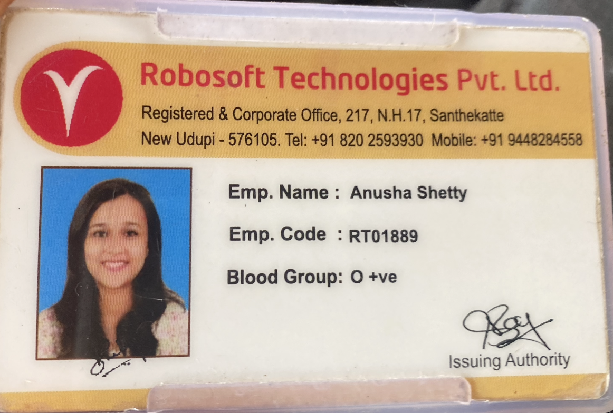
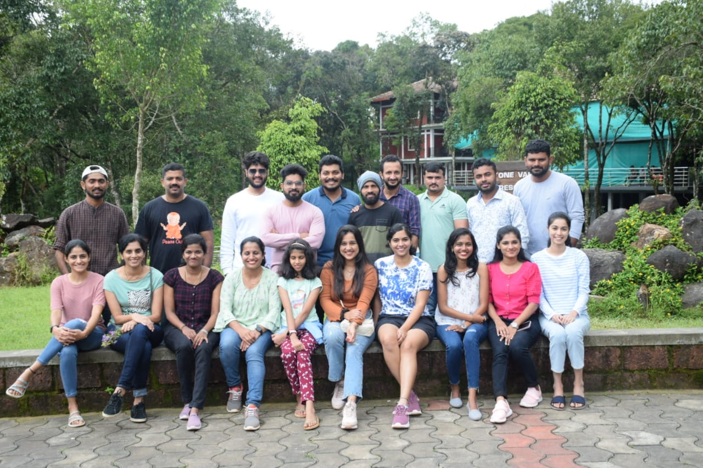
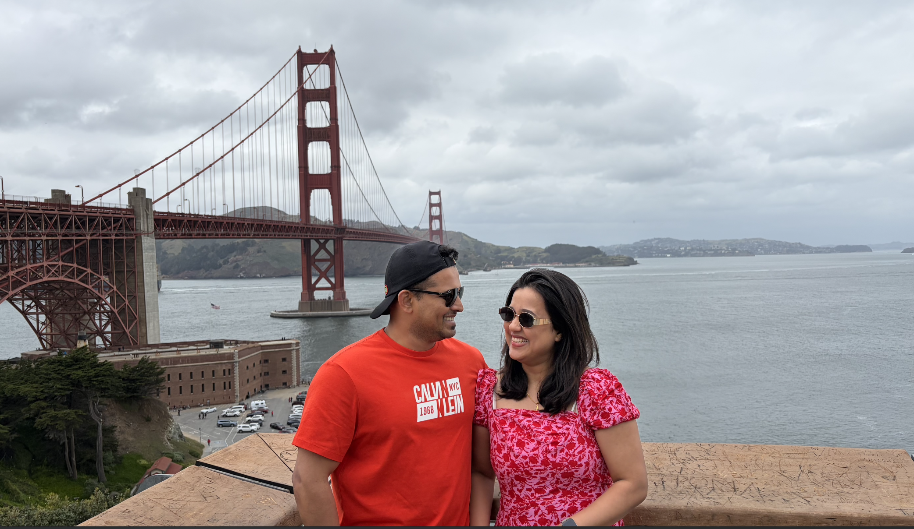
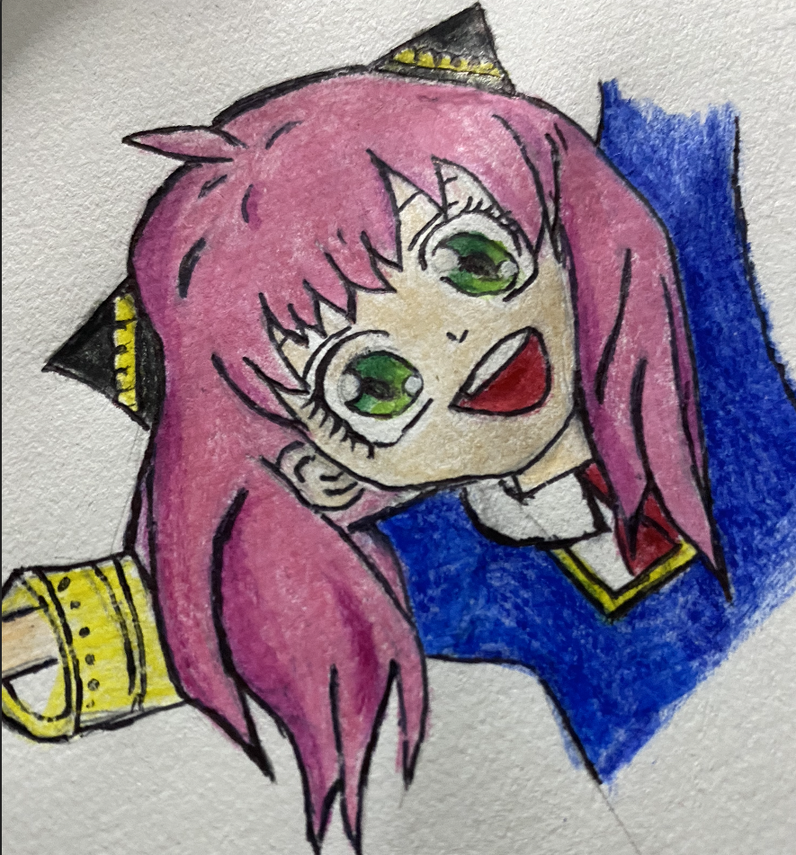
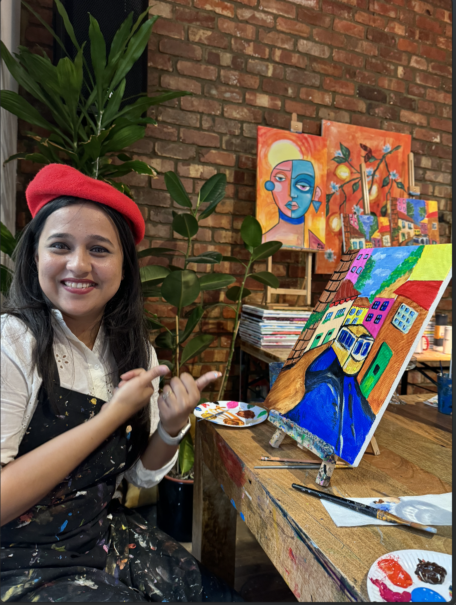

<a href="./" class="back-link">← Back to Portfolio</a>

# Beyond the Code

Life is more than just pull requests and deployments. Here's a little window into the journey that shaped me — and the things that bring me joy outside of work.

---

  

    
📍

    

      <h2>India — Where It All Began</h2>
      

        

          
          
My Work ID

        

        

          
          
My Office

        

      

      

        

          
          
My Team

        

      

      

        India is where my story starts. I grew up surrounded by warmth, colour, and the kind of food that makes every meal feel like a celebration.
        I built my career here over 4.5 years, working hard, learning fast, and falling in love with software engineering.
        It's where I became the engineer — and the person — I am today.
      

    

  

  

    
💍

    

      <h2>London — Love & A New Chapter</h2>
      

        🖼️
        
Add a wedding / London photo

        
        <small>Replace this placeholder by adding an image to assets/images/</small>
      

      

        One of the biggest adventures of my life — getting married and moving to London, UK.
        I spent 3 wonderful years there, exploring the city, growing professionally in product companies, and learning that home is wherever the people you love are.
        London will always hold a special place in my heart.
      

    

  

  

    
🌉

    

      <h2>California — The Next Adventure</h2>
      

        🖼️
        

        <small>Replace this placeholder by adding an image to assets/images/</small>
      

      

        And now, California! The sunshine, the energy, and the incredible tech community here are inspiring every single day.
        I'm actively building my next chapter — both personally and professionally — and excited about what lies ahead.
      

    

  

  

    
❤️

    

      <h2>What I Love Outside Work</h2>
      

        

          ✈️
          <h3>Travelling</h3>
          
Exploring new cultures, tasting local food, and collecting memories from around the world.

        

        

          🍳
          <h3>Cooking</h3>
          
From traditional Indian recipes to experimenting with cuisines from every corner of the globe.

        

        

          🎨
          <h3>Drawing</h3>
          
          
          
Sketching and creating art — a quiet, creative outlet that keeps me grounded and inspired.

        

      

    

  

